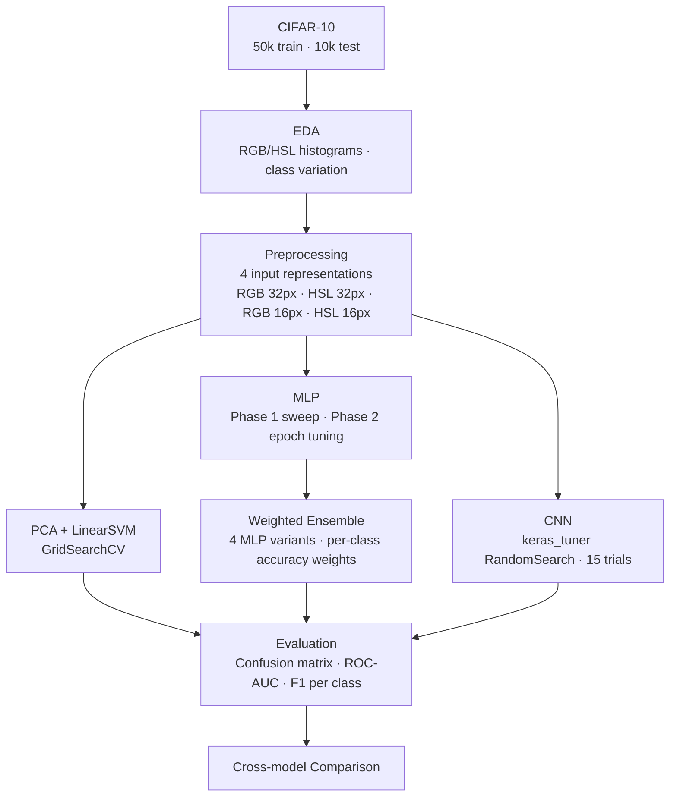

# ML Image Prediction — CIFAR-10 Classification

A comparison of three classifier families on the CIFAR-10 image dataset — built as part of COMP5318 Machine Learning and Data Mining at the University of Sydney.

---

## What It Does

Classifies 32×32 colour images into 10 categories (airplane, automobile, bird, cat, deer, dog, frog, horse, ship, truck) using three approaches: a classical PCA + SVM pipeline, a fully-connected MLP, and a convolutional neural network. Models are compared on test accuracy, training time, and per-class performance.

---

## Pipeline



---

## Models

| Model | Contributor | Key technique |
|---|---|---|
| PCA + Linear SVM | Classmate 1 | GridSearchCV over 4 variance targets × 6 C values, 3-fold stratified CV |
| MLP Weighted Ensemble | Jeannie Chang | 4 input variants (RGB/HSL × full/pooled), per-class accuracy weighted ensemble |
| CNN | Classmate 2 | keras_tuner RandomSearch over 5 hyperparameters, 15 trials |

---

## My Contributions

Data loading, EDA, all preprocessing (Section 1), and the MLP design and weighted ensemble (Sections 2-2, 3-2, 4-2).

**Preprocessing highlights:**
- Four input representations compared: RGB 32×32, HSL 32×32, RGB 16×16 (mean-pooled), HSL 16×16 (mean-pooled)
- HSL conversion parallelised with `joblib` for ~10× speedup over a plain Python loop
- Separate label handling for sklearn (1D integer) and Keras (one-hot)

**MLP highlights:**
- Phase 1: manual sweep over 2 activations × 7 layer configs × 2 batch sizes across all 4 input types
- Phase 2: epoch tuning per best config per input type
- Final: weighted ensemble combining all 4 MLP variants using per-class validation accuracy as weights

---

## Tech Stack

| Category | Tools |
|---|---|
| Language | Python 3.x |
| Deep Learning | TensorFlow / Keras, keras-tuner |
| ML | scikit-learn (PCA, LinearSVC, GridSearchCV) |
| Image processing | OpenCV, scikit-image |
| Data | NumPy, pandas |
| Visualisation | matplotlib, seaborn |
| Performance | joblib |

---

## How to Run

```bash
pip install tensorflow keras-tuner scikit-learn opencv-python scikit-image joblib pandas numpy matplotlib seaborn
jupyter notebook ml_image_prediction.ipynb
```

CIFAR-10 (~170 MB) is downloaded automatically on first run via `tf.keras.datasets.cifar10.load_data()` and cached locally — no manual download needed.

---

*COMP5318 Machine Learning and Data Mining — University of Sydney. Grade: High Distinction (85).*
